# 🍋 Guide Utilisateur — Générateur de Propositions BleuLemon

> Ce guide explique pas à pas comment utiliser l'application pour créer une proposition commerciale professionnelle en quelques minutes.

---

## 1. Page d'Accueil

Ouvrez l'application sur **http://localhost:3000**. Cliquez sur le bouton bleu **"Nouvelle proposition →"** pour commencer.

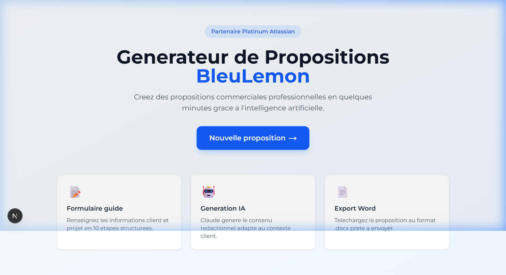

---

## 2. Étape 1 — Informations Client

Le formulaire s'ouvre sur l'étape **Client**. Vous voyez la barre de progression avec les 10 étapes en haut.

**Saisie manuelle** : Remplissez les champs (nom de l'entreprise, secteur, localisation, interlocuteur, etc.).

**✨ Magic Fill (Mode Démo)** : Cliquez sur le bouton violet **"Simuler des données de test"** en haut à droite pour pré-remplir automatiquement tous les champs avec un cas réel (Air France - KLM).

> Choisissez également la **Langue** de la proposition : Français ou Anglais. En mode Anglais, Claude traduit automatiquement l'intégralité du brief.

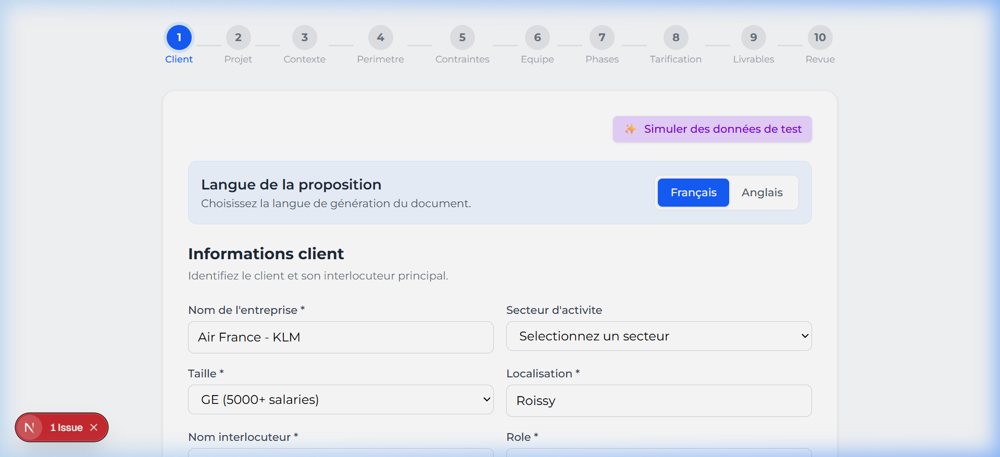

---

## 3. Étape 2 — Informations Projet

Renseignez le titre, le type de projet (Migration, Implémentation, Optimisation…), les outils Atlassian concernés et le mode de déploiement (Cloud, On-Premise).

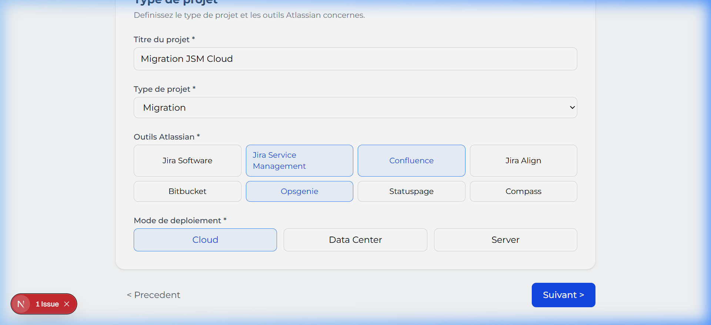

---

## 4. Étape 3 — Contexte & Besoins

Décrivez la **situation actuelle** du client, ses **objectifs business** et la volumétrie utilisateurs. Ces informations servent de brief à l'IA pour rédiger la section "Compréhension du besoin".

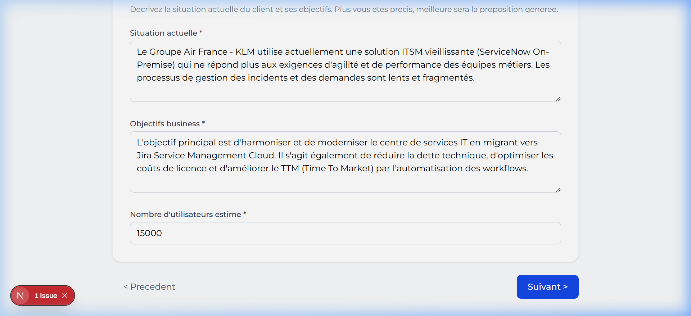

---

## 5. Étape 4 — Périmètre Fonctionnel

Définissez les modules Atlassian inclus dans le projet et toute précision sur le périmètre.

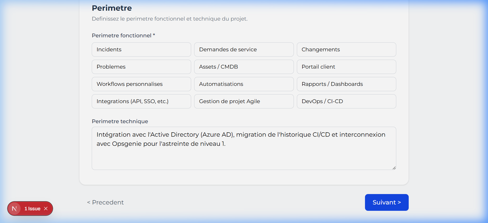

---

## 6. Étape 5 — Contraintes

Renseignez les contraintes projet : budget disponible, délais souhaités, contraintes techniques ou réglementaires. Ces champs sont optionnels.

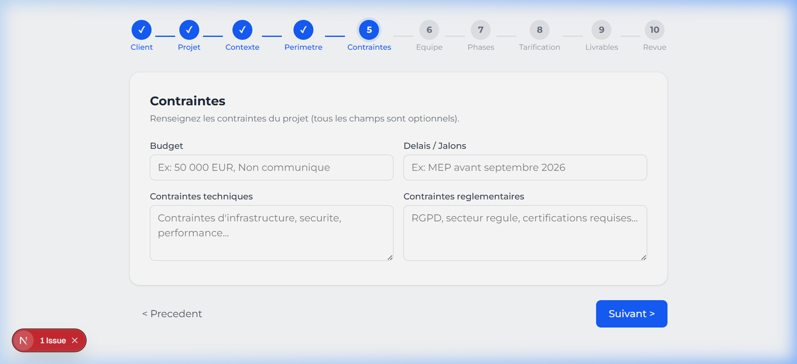

---

## 7. Étape 6 — Équipe BleuLemon

Ajoutez les membres de l'équipe BleuLemon qui interviendront sur le projet : nom, rôle et niveau d'expertise.

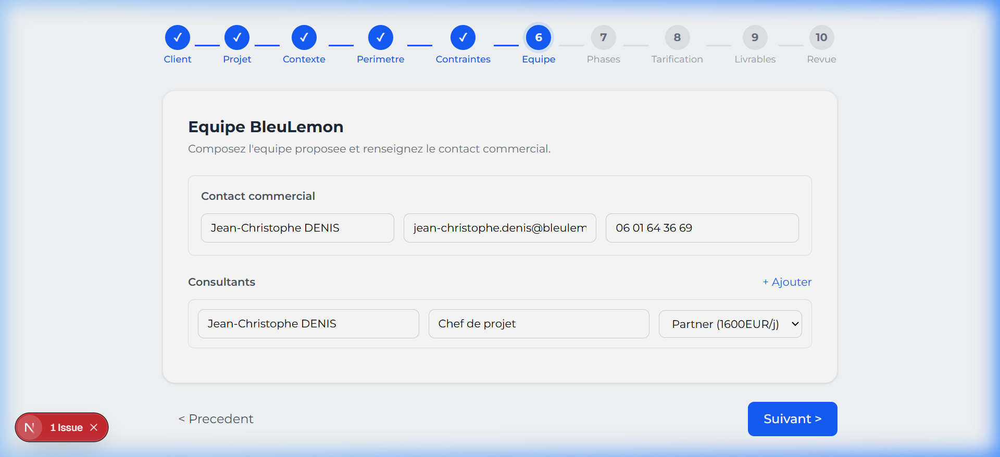

---

## 8. Étape 7 — Phases et Charges

Construisez le tableau des charges par phase. Pour chaque phase, renseignez :
- Le **nom de la phase** (ex: Cadrage et Ateliers)
- La **description** de la phase
- Le nombre de **Jours BleuLemon** et de **Jours Client**

Les totaux sont calculés automatiquement.

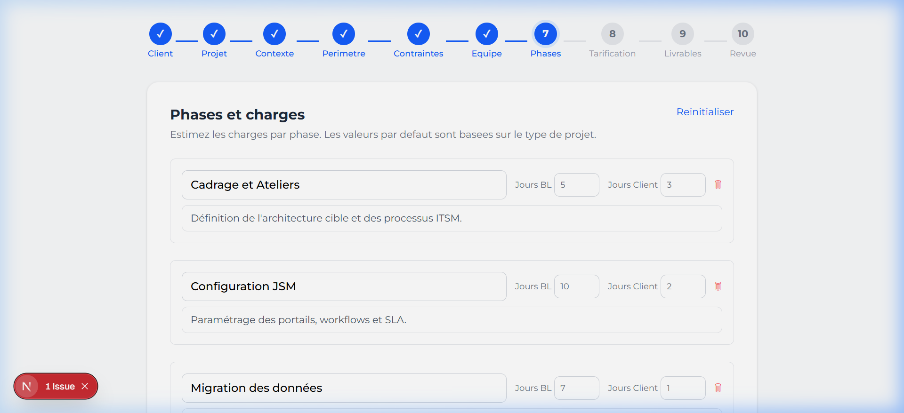

---

## 9. Étape 8 — Tarification

Renseignez les lignes de devis : poste, quantité et prix unitaire. Le total HT, la TVA à 20% et le total TTC se calculent en temps réel.

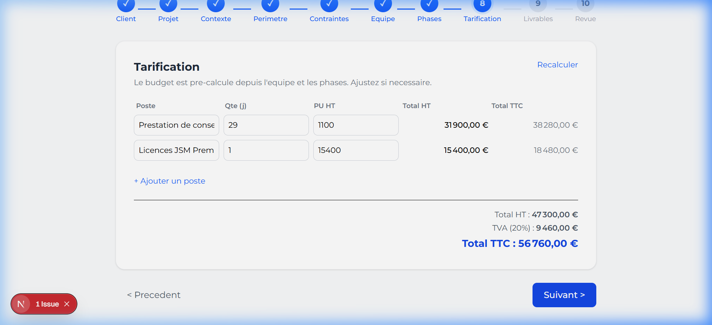

---

## 10. Étape 9 — Livrables & Prérequis

Spécifiez les livrables attendus et les prérequis nécessaires côté client pour le bon déroulement du projet.

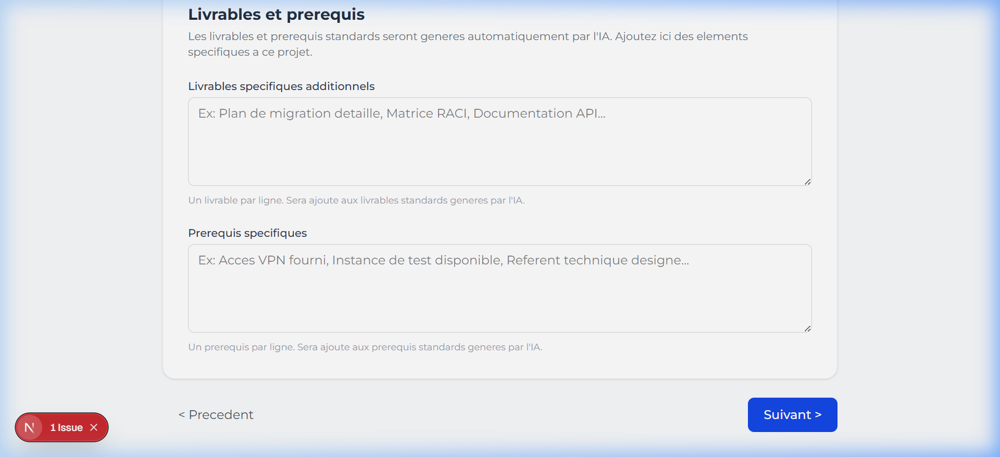

---

## 11. Étape 10 — Revue & Génération

C'est la dernière étape. Vous voyez un tableau récapitulatif de toutes vos données financières ainsi que les informations de la proposition.

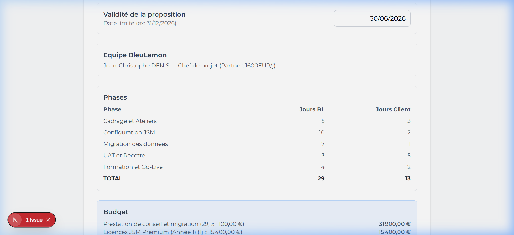

Depuis cette page, deux options s'offrent à vous :

### Option A — Génération Automatique via API ⚡

Cliquez sur **"Générer la proposition"**. L'application :
1. Envoie votre brief à **Claude Sonnet 4** (Anthropic)
2. L'IA rédige toutes les sections narratives en Plain Text professionnel
3. Les données sont injectées dans le template Word officiel BleuLemon
4. Le fichier **`.docx`** est téléchargé automatiquement sur votre ordinateur

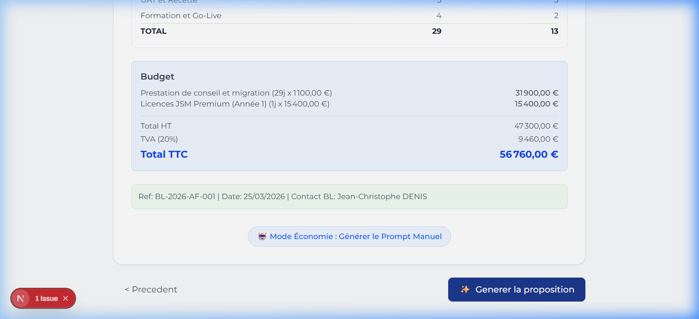

### Option B — Mode Secours (Sans crédits API) 🛡️

Cliquez sur **"Afficher le Prompt (Mode Secours)"**. Une modale s'ouvre avec le prompt complet structuré contenant toutes vos données. Il vous suffit de :
1. Copier le texte (bouton **"Copier le texte"**)
2. Ouvrir [claude.ai](https://claude.ai) dans votre navigateur
3. Coller le prompt et joindre votre template Word vierge
4. Claude génère le `.docx` complet pour vous, gratuitement

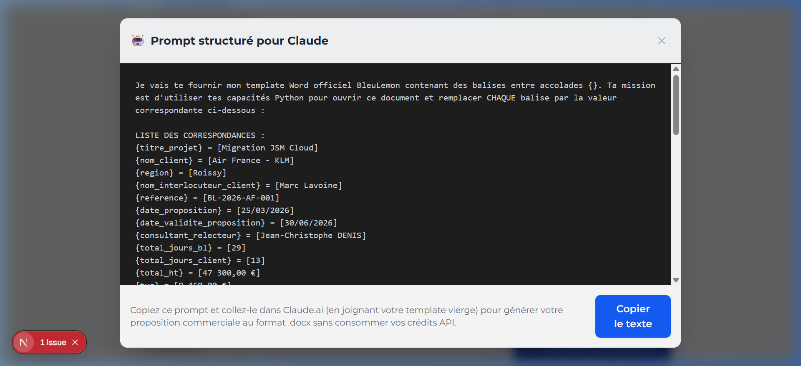

---

## Résultat Final

Le document Word généré reprend l'intégralité de la charte graphique BleuLemon avec :
- Les en-têtes et pied de page officiels
- Les tableaux de charges et de tarification remplis
- Les sections narratives rédigées par l'IA, adaptées au contexte du client
- Les totaux financiers formatés (ex: `47 300,00 €`)

---

> 🍋 **BleuLemon** — Partenaire Platinum Atlassian
